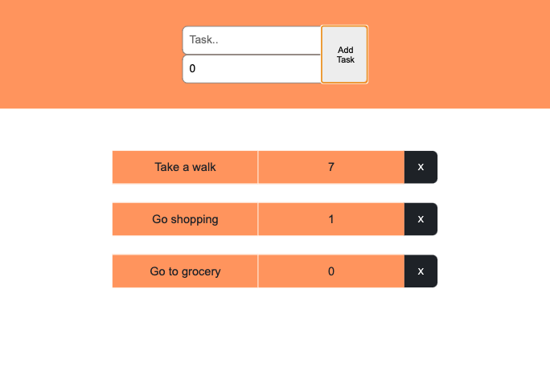

# React Typescript ToDoList2 (todo-react-type2)

Simple todolist using react and typescript

## Setup

The project requires npm and nodeJS installed

###  Build Project

1. Install typescript: `yarn create react-app . --template typescript`
refer [here](https://create-react-app.dev/docs/adding-typescript/)
2. Install project dependencies: `npm install` or `yarn install`

## Other resources
| Source | Url |
|----------|-----|
|Typescript official docs   | https://www.typescriptlang.org/docs/handbook/typescript-in-5-minutes.html |
|React+TypeScript Cheatsheets  | https://github.com/typescript-cheatsheets/react   |
| Typescript&React class component | https://www.digitalocean.com/community/tutorials/react-typescript-with-react |

